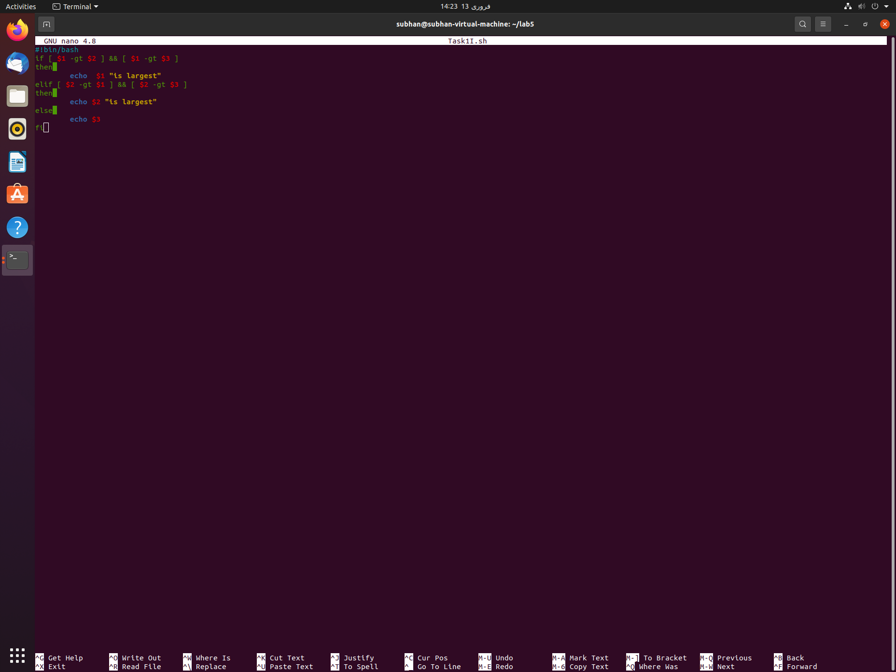
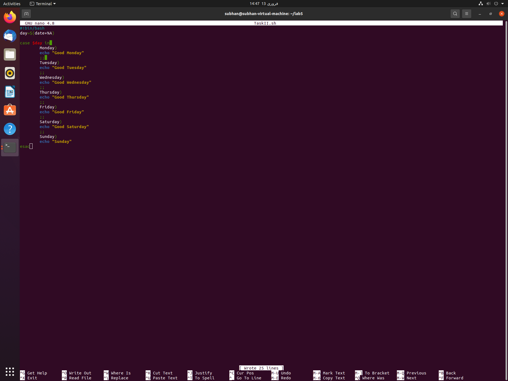
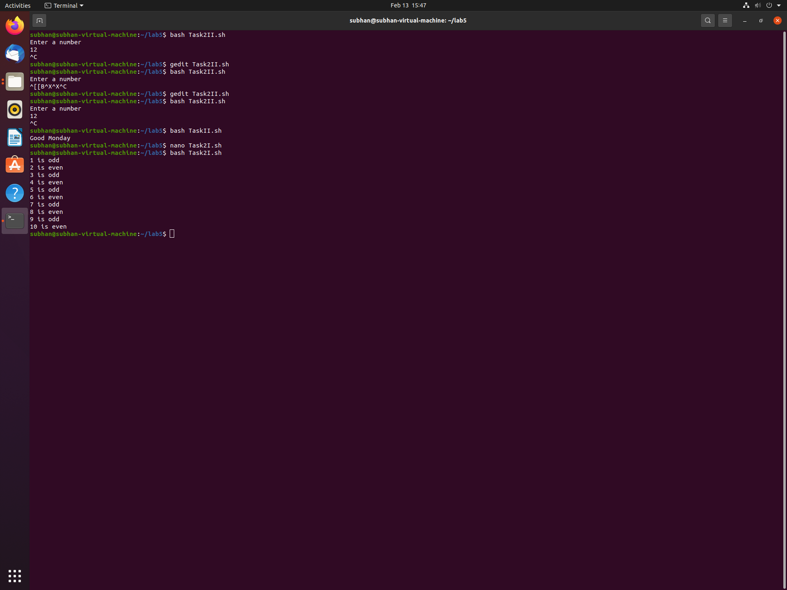
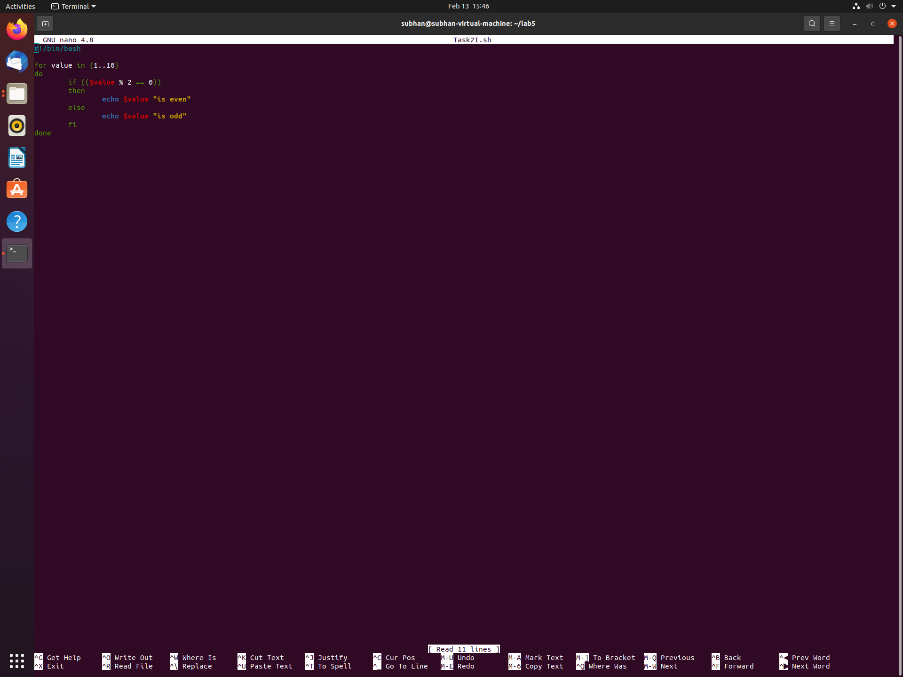
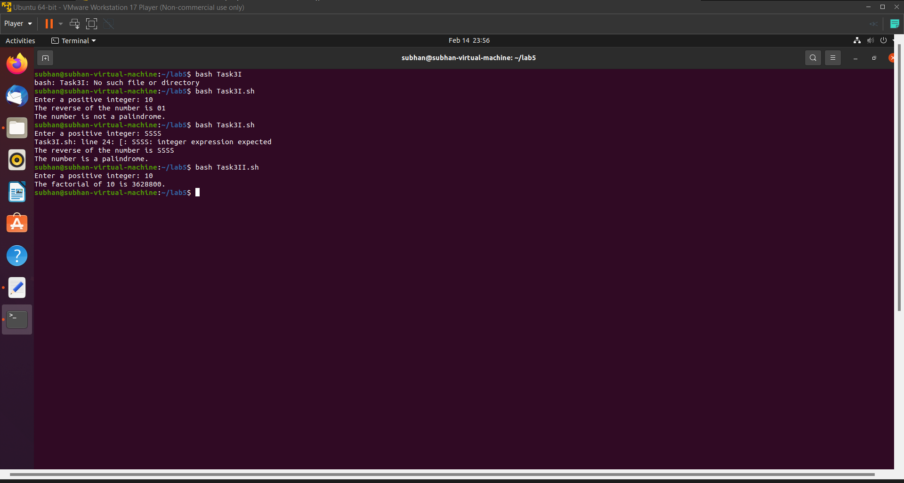

# Task 1

---

> 1. Create a Bash script which will take 3 numbers as command line arguments. It will print to the screen the larger of the three numbers.
> 2. Create a Bash script which will print a message based upon which day of the week it is (eg. 'Happy day' for Wednesday, 'blessed' for Friday etc) using switch statement.

####Create a Bash script which will take 3 numbers as command line arguments. It will print to the screen the larger of the three numbers.

1. Create a file named `touch Lab4I.sh.` 

   *This command creates a new empty file with the specified name. 

   ​				The syntax is **touch *newfilename****

2. Open file in nano using `nano Lab4I.sh`

   *This command opens the file in the nano text editor, which allows you to write and edit the Bash script.* Save and exit the file by pressing "Ctrl-X", then "Y", and then "Enter".

3. Write the code provided below:

```
#!bin/bash
if [ $1 -gt $2 ] && [ $1 -gt $3 ] then
  echo $1 "is largest"
elif [ $2 -gt $1 ] && [ $2 -gt $3 ] then
  echo $2 "is largest"
else
  echo $3 "is largest"
fi
```

4. The code above first use **\$1,\$2 and \$3** as  command line arguments. The compare them using if in bash script and then print largest of them.

   >if [ condition ]
   >then
   >
   >**`code for true Condtion`**
   >
   >else
   >
   >**`code to execute if condition is false`**
   >
   >fi

5. change the permission to executable using `chmod uo+x Lab4I.sh`.

   > ######`Chmod Command`
   >
   > The command 	`chmod uo+x Lab4I.sh` changes the permissions of the file "Lab4I.sh" to make it executable. The `chmod` command is used to modify the permissions of a file or directory, and the `uo+x` option specifies that the user (owner) and others (all) should be given execute permission (+x) on the file. This means that the owner of the file and anyone else who has access to it can run the script by typing its name in the terminal. Without execute permission, the file cannot be executed and the user would see a "permission denied" error when trying to run it.

6. Run file using `bash Lab4I.sh 10 15 100`. The command "bash Lab4I.sh 10 15 100" runs the Bash script "Lab4I.sh" and passes three command line arguments to it: 10, 15, and 100. run it by typing `./script.sh 10 15 100`. 

    

   

   ####Create a Bash script which will print a message based upon which day of the week it is (eg. 'Happy day' for Wednesday, 'blessed' for Friday etc) using switch statement


1. Create a file named **"touch Lab4II.sh"**. 

   *This command creates a new empty file with the specified name. 

   ​				The syntax is **touch *newfilename****

2. Open file in nano using **"nano Lab4II.sh"**

   *This command opens the file in the nano text editor, which allows you to write and edit the Bash script.*

   Save and exit the file by pressing "Ctrl-X", then "Y", and then "Enter".

3. Write the code provided below:

```
#!/bin/bash

day=$(date +%A)

case $day in
  Monday)
    echo "Good Monday"
    ;;
  Tuesday)
    echo "Bad Tuesday"
    ;;
  Wednesday)
    echo "Good Wednesday"
    ;;
  Thursday)
    echo "Bad Thursday"
    ;;
  Friday)
    echo "Good Friday"
    ;;
  Saturday)
  	echo "Bad Saturday"
  Sunday)
  	echo "Good Sunday"

```

4. The code above uses switch statement to compare day variable with all of seven days  and print based on specific day. The basic syntax of case in :

   ```
   #!/bin/bash
   case foo in 
   	value 1)
   		//code
   		;;
   	value 2)
   		//code
   		;;
   esac
   ```

   **Note: 'Do forget to end with *esac*'**

5. change the permission to executable using **chmod uo+x Lab4II.sh**

   ###### `Chmod Command`

   The command `"chmod uo+x` Lab4I.sh" changes the permissions of the file "Lab4I.sh" to make it executable. The `"chmod"` command is used to modify the permissions of a file or directory, and the `"uo+x"` option specifies that the user (owner) and others (all) should be given execute permission (+x) on the file. This means that the owner of the file and anyone else who has access to it can run the script by typing its name in the terminal. Without execute permission, the file cannot be executed and the user would see a "permission denied" error when trying to run it.

6. Run it by typing `./script.sh`. Alternatively, you can use un file using `bash Lab4II.sh`.

   

   

# Task 2

------

> 1. Create a simple script which will print the numbers 1 - 10 (each on a separate line) and whether they are even or odd.
> 2. Write a program that read number as input, calculate, and return the summation of the all digits of the number.
>   Example:
>   If given number: 745 Then result will be: (7+4+5) = 16

------

####Create a simple script which will print the numbers 1 - 10 (each on a separate line) and whether they are even or odd.

1. Create a file named `touch Lab3II.sh.` 

   *This command creates a new empty file with the specified name. 

   ​				The syntax is **touch *newfilename****

2. Open file in nano using `nano Lab3II.sh`

   *This command opens the file in the nano text editor, which allows you to write and edit the Bash script.* Save and exit the file by pressing "Ctrl-X", then "Y", and then "Enter".

3. Write the code provided below:

   ```
   #!/bin/bash
   #!/bin/bash

   for i in {1..10}
   do
       if [ $((i % 2)) -eq 0 ]; then
           echo "$i is even"
       else
           echo "$i is odd"
       fi
   done
   ```

4. The code above calculate factorial

5. change the permission to executable using **chmod uo+x Lab3II.sh**

> ###### `Chmod Command`
>
> The command `"chmod uo+x` Lab4I.sh" changes the permissions of the file "Lab4I.sh" to make it executable. The `"chmod"` command is used to modify the permissions of a file or directory, and the `"uo+x"` option specifies that the user (owner) and others (all) should be given execute permission (+x) on the file. This means that the owner of the file and anyone else who has access to it can run the script by typing its name in the terminal. Without execute permission, the file cannot be executed and the user would see a "permission denied" error when trying to run it.

1. Run it by typing `./script.sh`. Alternatively, you can use `bash`

   

   

#### Write a program that read number as input, calculate, and return the summation of the all digits of the number.Example: If given number: 745 Then result will be: (7+4+5) = 16

1. Create a file named `touch Lab3II.sh.` 

   *This command creates a new empty file with the specified name. 

   ​				The syntax is **touch *newfilename****

2. Open file in nano using `nano Lab3II.sh`

   *This command opens the file in the nano text editor, which allows you to write and edit the Bash script.* Save and exit the file by pressing "Ctrl-X", then "Y", and then "Enter".

3. Write the code provided below:

   ```
   #!/bin/bash
   #!/bin/bash

   read -p "Enter a number: " num

   sum=0
   for ((i=0; i<${#num}; i++)); do
     digit=${num:$i:1}
     sum=$((sum + digit))
   done

   echo "The sum of the digits is: $sum"

   ```

4. The code above calculate factorial

5. change the permission to executable using **chmod uo+x Lab3II.sh**

> ###### `Chmod Command`
>
> The command `"chmod uo+x` Lab4I.sh" changes the permissions of the file "Lab4I.sh" to make it executable. The `"chmod"` command is used to modify the permissions of a file or directory, and the `"uo+x"` option specifies that the user (owner) and others (all) should be given execute permission (+x) on the file. This means that the owner of the file and anyone else who has access to it can run the script by typing its name in the terminal. Without execute permission, the file cannot be executed and the user would see a "permission denied" error when trying to run it.

1. Run it by typing `./script.sh`. Alternatively, you can use un file using `bash Lab3II.sh`.

   

# Task 3

------

> 1. Write a shell script which takes a positive integer as an argument on the
>    terminal and then checks if it is a palindrome or not. In order to find the
>    reverse of this number it must be passed to function named reverse(), which
>    computes the reverse and passes both, the number and its reverse to another
>    function called palindromeCheck(). palindromeCheck() then compares the
>    numbers and echoes if the number is a palindrome or not.
> 2. Write a shell script which reads a number from the user and passes it to
>   function named factorial(). This function finds the factorial of the number and
>   prints it on the terminal. This task must be done using recursion.

------

#### Write a shell script which takes a positive integer as an argument on the terminal and then checks if it is a palindrome or not. In order to find the reverse of this number it must be passed to function named reverse(), which computes the reverse and passes both, the number and its reverse to another function called palindromeCheck(). palindromeCheck() then compares the numbers and echoes if the number is a palindrome or not.

1. Create a file named `touch Lab3II.sh.` 

   *This command creates a new empty file with the specified name. 

   ​				The syntax is **touch *newfilename****

2. Open file in nano using `nano Lab3II.sh`

   *This command opens the file in the nano text editor, which allows you to write and edit the Bash script.* Save and exit the file by pressing "Ctrl-X", then "Y", and then "Enter".

3. Write the code provided below:

   ```
   #!/bin/bash

   function reverse() {
     local number=$1
     local reverse=""
     for ((i=${#number}-1; i>=0; i--)); do
       reverse="$reverse${number:$i:1}"
     done
     echo $reverse
   }

   function palindrome_check() {
     number=$1
      reverse=$2
     if [ "$number" == "$reverse" ]; then
       echo "The number is a palindrome."
     else
       echo "The number is not a palindrome."
     fi
   }

   echo "Enter a positive integer: "
   read number

   if [ $number -lt 0 ]; then
     echo "Enter a positive integer."
     exit 1
   fi

   reverse_num=$(reverse "$number")
   echo "The reverse of the number is "$reverse_num
   palindrome_check "$number" "$reverse_num"
   ```

4. The code above calculate factorial

5. change the permission to executable using **chmod uo+x Lab3II.sh**

> ###### `Chmod Command`
>
> The command `"chmod uo+x` Lab4I.sh" changes the permissions of the file "Lab4I.sh" to make it executable. The `"chmod"` command is used to modify the permissions of a file or directory, and the `"uo+x"` option specifies that the user (owner) and others (all) should be given execute permission (+x) on the file. This means that the owner of the file and anyone else who has access to it can run the script by typing its name in the terminal. Without execute permission, the file cannot be executed and the user would see a "permission denied" error when trying to run it.

1. Run it by typing `./script.sh`. 

   

####Write a shell script which reads a number from the user and passes it tofunction named factorial(). This function finds the factorial of the number andprints it on the terminal. This task must be done using recursion.

1. Create a file named `touch Lab3II.sh.` 

   *This command creates a new empty file with the specified name. 

   ​				The syntax is **touch *newfilename****

2. Open file in nano using `nano Lab3II.sh`

   *This command opens the file in the nano text editor, which allows you to write and edit the Bash script.* Save and exit the file by pressing "Ctrl-X", then "Y", and then "Enter".

3. Write the code provided below:

   ```
   #!/bin/bash

   function factorial() {
     n=$1
     res=1
     while [ $n -gt 0 ]; do
       res=$((res * n))
       n=$((n - 1))
     done
     echo $res
   }
   echo "Enter a positive integer: " 
   read num

   if [ $num -lt 0 ]; then
     echo "Negative number...."
     exit 1
   fi

   result=$(factorial $num)
   echo "The factorial of $num is $result."
   Does this code work
   ```

4. The code above calculate factorial

5. change the permission to executable using **chmod uo+x Lab3II.sh**

> ###### `Chmod Command`
>
> The command `"chmod uo+x` Lab4I.sh" changes the permissions of the file "Lab4I.sh" to make it executable. The `"chmod"` command is used to modify the permissions of a file or directory, and the `"uo+x"` option specifies that the user (owner) and others (all) should be given execute permission (+x) on the file. This means that the owner of the file and anyone else who has access to it can run the script by typing its name in the terminal. Without execute permission, the file cannot be executed and the user would see a "permission denied" error when trying to run it.

5. Run it by typing `./script.sh`. Alternatively, you can use un file using `bash Lab3II.sh`.

